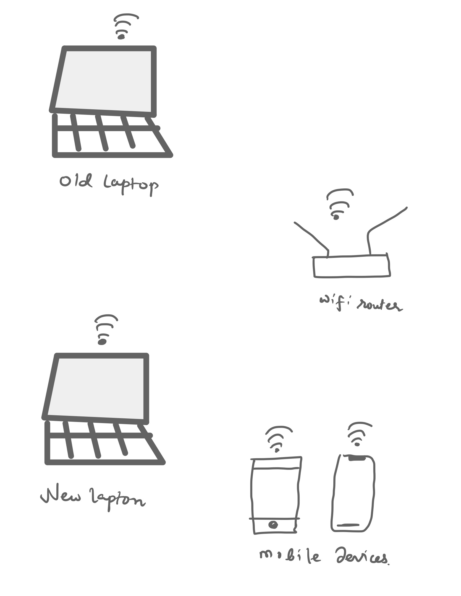

# Anime server

a self-hosted Anime server for those who like to save things and watch them.

### Why self hosting 

I have several devices ranging from tablets to smarthphones to laptops.
They have low storage ranging from 64GB to 128GB and in this era of streaming
we dont usually have lots of content on our devices.

[](./WhySelfHosting-1.jpg)


I wanted to have some of my favourite shows on my own machine.
Also having a peer to peer with the help of syncthing network was my initial goal
but that did't worked because the size of library excessed my device's storage which led to implement
a client-server architecture with my old laptop acting as a server with TB of storage.

so here we are all my devices connected to a single wifi network.

I also got inspired to build few things on my own after watching this video
https://www.youtube.com/watch?v=wWaWt9d3yw0


[](./anime-server.png)

### Setup

clone this repo and create Anime folder and paste all your content there


Install packages via 

```bash
npm install 
```

Run this server via

```bash
npm run start
```


